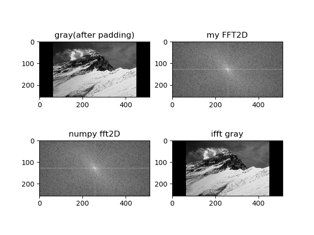

# Exercises

## 1.1

$$
\begin{aligned}
DFT[f(x,y)] &= DFT[cos(2πu_0x+2πv_0y)] \\
&=DFT[\frac{1}{2}(e^{i2π(u_0x+v_0y)}+e^{-i2π(u_0x+v_0y)})]\\
&=\frac{1}{2}(DFT[(e^{i2π(u_0x+v_0y)}]+DFT[e^{-i2π(u_0x+v_0y)})])\\
&=\frac{1}{2}(DFT[1 * e^{2πi(\frac{u_0xM}{M}+\frac{v_0yN}{N})}]+DFT[1 * e^{-2πi(\frac{u_0xM}{M}+\frac{v_0yN}{N})})])\\
\end{aligned}
$$
又根据离散傅里叶变换平移性质,有 $DFT[f(x,y) * e^{-2πi(\frac{u_0x}{M}+\frac{v_0y}{N})}] = F(u+u_0,v+v_v0)$，且$DFT[1]= \delta(u,v)$，则有
$$
\begin{aligned}
原式=\frac{1}{2}[\delta(u-u_0M,v-v_0N)+\delta(u+u_0M,v+v_0N)]
\end{aligned}
$$

## 1.2

因为在使用零像素值对图像进行填充时，会使得图片四个边缘的出现灰度值的跳跃，所以会出现在一个方向变化强烈，另一个方向变化不明显的高频分量，所以在对应的频谱分量的能量会增加，即在频谱图上水平和和垂直坐标轴轴方向上的频谱分量的谱幅度会增强。

## 1.3

定义Laplacian算子$h(x,y)$与原图像$f(x,y)$卷积后的图像为$g(x,y) = f(x,y)☆h(x,y)$，且有$g(x,y) = f(x+1,y)+f(x-1,y)+f(x,y+1)+f(x,y-1)-4f(x,y)$
故Laplacian算子在频率域的
$$
\begin{aligned}
H(u,v) &=\frac{G(u,v)}{F(u,v)}\\
&=\frac{DFT[f(x+1,y)+f(x-1,y)+f(x,y+1)+f(x,y-1)-4f(x,y)]}{F(x,y)} \\
&=\frac{ e^\frac{-j2πu}{M}F(u,v)+e^\frac{j2πu}{M}F(u,v)+e^\frac{-j2πv}{N}F(u,v)+e^\frac{j2πv}{N}F(u,v)-4F(u,v)}{F(u,v)}\\
&=e^\frac{-j2πu}{M}+e^\frac{j2πu}{M}+e^\frac{-j2πv}{N}+e^\frac{j2πv}{N}-4\\
&=2cos⁡(\frac{j2πu}{M})+2cos⁡(\frac{j2πv}{N})-4
\end{aligned}
$$

## 1.4

步骤a为将原函数乘上一个旋转因子，根据离散傅里叶变换的平移性质，且在步骤e中恢复，故步骤a，e不会使图像发生变化，b，d为傅里叶变换与反变换，也不会使图像发生变化，所以重点考虑步骤c中发生的变换。
因为对F取共轭，则有
$$|F^*(u,v)|=\sqrt{R^2(u,v)+I^2(u,v)}$$
$$Φ^*(u,v)=arctan⁡[-\frac{I(u,v)}{R(u,v)}]$$
又因为
$$|F(u,v)|=\sqrt{R^2(u,v)+I^2(u,v)}$$
$$Φ(u,v)=arctan⁡[\frac{I(u,v)}{R(u,v)}]$$
所以有
$$|F(u,v)|=|F^*(u,v)|$$
$$Φ^*(u,v)=-Φ(u,v)$$
即频率谱分量的幅度没有发生变化，相角变化$π$。
又因为在二维傅里叶变换中，频谱图幅度是一个阵列时，其成分决定了图像的灰度；相位信息表征了各个正弦分量偏离原点的度量，也就是每一个正弦波在图像中的位置。所以还原回来的图片像素点的值不发生变化，但是图像中图形位置旋转$π$，即发生中心对称，固有题目右边的结果图。

## 1.5

首先对原公式进行变形:
$$\hat{f}(x,y)=\frac{\sum_{(s,t)∈S_{xy}}g(s,t)^Qg(s,t)}{\sum_{(s,t)∈S_{xy}}g(s,t)^Q}=\sum_{(s,t)∈S_{xy}}\frac{g(s,t)^Q}{\sum_{(s,t)∈S_{xy}}g(s,t)^Q}g(s,t)$$

上式可以看作求(x,y)邻域内所有(s,t)点的加权平均值，权重系数为$\frac{g(s,t)^Q}{\sum_{(s,t)∈S_{xy}}g(s,t)^Q}$，因为权重的分母$\sum_{(s,t)∈S_{xy}}g(s,t)^Q$对邻域内所有点都是一个常数，因此我们只需要考虑分子$g(s,t)^Q$的大小。当Q>0时，$g(s,t)^Q$对g(s,t)有增强作用，由于“胡椒”噪声值较小，对加权平均结果影响较小，领域权重相对较大，所以滤波后噪声点处(x,y)取值和周围其他值更接近，有利于消除“胡椒”噪声。但是“椒盐”噪声相反，因为椒盐噪声值比较大，所以噪声点的权重较大，相邻权重较小，可能会进一步使当前像素点值与邻域像素点值远离，效果不明显甚至可能更差。

## 1.6

### 1.6.1

图像的频谱图包含空间图像变化特征，在图像的空间域中，图像灰度变换缓慢的区域，对应于图像的频率域中的低频成分，而图像灰度变换较快的地方，对应于图像高频成分，如果频谱图的高频成分越多，图像灰度变化率变换大，有较多的边缘，如果频谱图的低频成分越多，图像越平滑。

### 1.6.2

指向频谱图中心的箭头所对应的频率分量是整幅图的低频分量对应的是原空间图的平均背景亮度。
指向频谱图中心的箭头所对应的频率分量是x方向上的低频分量，y方向上的较高频分量，对应的是原图上y方向的像素值变化快慢程度。

### 1.6.3

该滤波器是一个低通滤波器。只保留了频谱图的低频分量，在空间图中为对应的均值滤波器。

# 2 Programming Tasks

## 2.1&2.2

图 1

## 2.3

根据FFT算法可知，完成一个M*M矩阵FFT所需要的复数乘法次数$m(n)=\frac{1}{2}Mlog_2M$，复数加法次数为$a(n)=M\log_2M$，相对于直接做二次一维DFT加法和乘法的计算量为$M^2$有以下计算优势：
$$
c_m(n)=\frac{2M}{log_2M}
$$
$$
c_a(n)=\frac{M}{log_2M}
$$
故所需计算时间减少。

## 2.4

实现FFT可以大概分成以下几步：
1、首先读取图像，并在边缘补零至能被2的k次方整除
2、分别对M行和N列进行FFT变换
3、首先递归调用FFT函数至维数N=2层，直接用用DFT公式计算$2*M$奇数项矩阵，然后同理计算两个偶数项矩阵，再根据$F(u,v)=$计算出对应$4*M$个频谱值，作为返回值座位上一层的奇数项矩阵，同理计算出偶数项矩阵，按照公式$$计算出对应$8*M$个频谱值，返回上一次奇数项矩阵，同理计算出偶数项矩阵，以此类推最后计算出行的FFT结果。
4、同理计算出列的FFT结果
5、根据输入参数判断是IFFT还是FFT,如果是FFT对矩阵分割和平移并重新组合，如果是IFFT直接将结果矩阵除矩阵维数获得结果。

