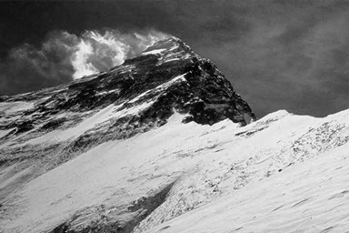

# Exercises

## 1.1

$$
\begin{aligned}
DFT[f(x,y)] &= DFT[cos(2πu_0x+2πv_0y)] \\
&=DFT[\frac{1}{2}(e^{i2π(u_0x+v_0y)}+e^{-i2π(u_0x+v_0y)})]\\
&=\frac{1}{2}(DFT[(e^{i2π(u_0x+v_0y)}]+DFT[e^{-i2π(u_0x+v_0y)})])\\
&=\frac{1}{2}(DFT[1 * e^{2πi(\frac{u_0xM}{M}+\frac{v_0yN}{N})}]+DFT[1 * e^{-2πi(\frac{u_0xM}{M}+\frac{v_0yN}{N})})])\\
\end{aligned}
$$
又根据离散傅里叶变换平移性质,有 $DFT[f(x,y) * e^{-2πi(\frac{u_0x}{M}+\frac{v_0y}{N})}] = F(u+u_0,v+v_v0)$，且$DFT[1]= \delta(u,v)$，则有
$$
\begin{aligned}
原式=\frac{1}{2}[\delta(u-u_0M,v-v_0N)+\delta(u+u_0M,v+v_0N)]
\end{aligned}
$$

## 1.2

因为在使用较大范围零像素值对图像进行填充时，会使得图片边缘的出现一片像素值相同的区域，相当于在图像边缘平滑了图像，所以在对应的频谱图上低频分量的能量会增加，这样在傅里叶频谱图在水平和垂直轴方向高频对应的谱幅度会增强。

## 1.3

# 2 Programming Tasks
原图如图1所示。

图 1

## 2.2 Histogram Equalization

### 2.2.1
原图的直方图如图2所示。

图 2

### 2.2.2
经过第一次直方图均衡化的图片如图3所示。

图 3

经过第一次直方图均衡化的图片直方图如图4所示。

图 4

### 2.2.3
经过第二次直方图均衡化的图片直方图如图5所示。

图 5

由图中可以得出第二次均衡化的结果和第一次均衡化的结果相同，原因是根据均衡化变换函数一个重要性质：单值且单调递增。即说明经过灰度变换后，相对大小不变，较大的灰度仍对应较大的灰度。且根据均衡化如下公式1，不难得出均衡化后像素值只跟原像素值变量的CDF有关，第一次均衡化后像素值[0,255]均匀分布，CDF在[0,1]之间有 $∑_{j=0}^kP_r(r_j) = k$ ，所以下一次均衡结果和第一次均衡化结果相同。
$$
s_k=T(r_k)=(L-1)∑_{j=0}^kP_r(r_j)（公式1）
$$

### 2.2.4
实现直方图均衡化的可以大概分成以下4步：
1、首先遍历整个图像记录下每个灰度级的频数。
2、每个灰度级频数与总像素相除，获得每个灰度级 $r_k$ 的频率$(k = 0,1,...,L-1,L为灰度级总数)$，即获得灰度级的PDF，以 $p(r_k)$ 表示。
3、从小到大遍历所有灰度级并对PDF累计求和，计算CDF，以 $F_r(r_k)$。
4、通过公式$s_k = (L-1)F_r(r_k)$，遍历输入图像，对应计算每个位置输出图像的灰度级，即获得直方图均衡化图像。

## 2.3 Spatial Filtering
### 2.3.1
经过3*3平均值滤波器结果图如图6所示。

图 6

经过3*3平均值滤波器结果图如图7所示。

图 7

经过5*5平均值滤波器结果图如图8所示。

图 8

经过7*7平均值滤波器结果图如图9所示。

图 9

### 2.3.2
经过3*3拉普拉斯滤波器结果图如图10所示。

图 10

拉普拉斯算子是二阶微分算子，二阶微分可以描述图像变化的速度，急剧增长下降还是平缓的增长下降，运用拉普拉斯可以增强图像的细节，找到图像的边缘，在与原图像进行相应的叠加可以得到锐化后图像。

### 2.3.3
经过高通3*3滤波器，且k=2时结果图如图11所示。

图 11

### 2.3.4
实现空间滤波的可以大概分成以下4步：
1、首先先180°翻转滤波器
2、根据滤波器宽度选择以0填充图像背景。
3、以滤波产生的新图片为基础遍历所有像素点，像素值为对应原图像素点与滤波器点乘求和。因为原图像已经根据滤波器宽度进行相应扩充，故有 $image[i][j]_{filter} = np.sum(image_{padded}[i:i+filter.shape[0], j:j+filter.shape[0]]*filter)$ 其中 $image[i][j]_{filter}$ 为滤波后图像数组，$image_{padded}$为扩充背景后原图像， $filter$ 为滤波器矩阵，矩阵乘法为对应元素相乘，$np.sum$ 为矩阵所有元素相加。
4、再根据不同空间滤波方法，原图像（未填充背景）和滤波后图像进行相应处理，得到最终的输出图像

