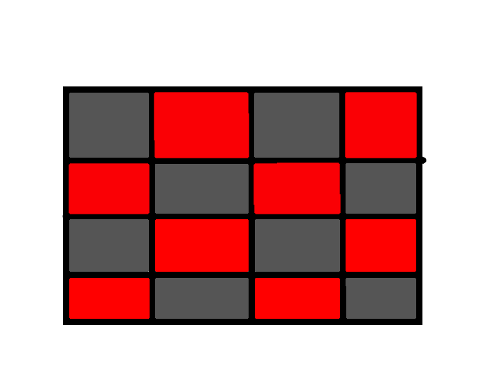

# Exercises

## 1.1

### 1.1.1

将64$\times$64的图像$Img$分割成四个不重叠的32$\times$32块$K_i$，则有$Img=K_y+K_m+K_c+K_g$
首先由公式1计算归一化后强度$I$
$$
\begin{aligned}
I = \frac{1}{3}(R+G+B)
\end{aligned}
$$
结果如图1所示

图 1

再由公式2计算归一化后饱和度$S$
$$
\begin{aligned}
S = 1-\frac{1}{I}[min(R,G,B)]
\end{aligned}
$$
结果如图2所示

图 2

再由公式3计算归一化后色调$H$

$$
H =\begin{cases}
\theta& \text{B$\leq$G}\\
360-\theta& \text{B>G}
\end{cases}
$$

其中$\theta$为
$$
\theta =arccos \lbrace
    \frac{\frac{1}{2}[(R-G)+(R-B)]}{[(R-G)^2+(R-B(G-B)]^{\frac{1}{2}}}
\rbrace
$$

结果如图3所示

图 3

最终归一化后HSI通道值结果如图4所示

图 4

### 1.1.2

对该图在HSI域的S分量做算法平均滤波后图片不发生变化。原因由图二可知，因为四个区域的S值都为1，即都已饱和，均值后所有值不变且均为1，所以该图对S通道进行模糊后不会发生变化。

## 1.2

根据整副图像的最小变化区域，可以将整幅图像看做一个4*4像素的图像，故根据相应的HSI转RGB公式可得

图 4

图5为RGB效果图

图 5

## 1.3

假设给定颜色c的坐标为$(x,y)$,且c与c1的距离为d1，c与c2的距离为d2，c1与c2的距离为D，已知该给定的颜色在两个颜色连线上，则有

$$
d_1=[(x-x_1)^2+(y-y_1)^2]^{\frac{1}{2}}
$$
$$
d_2=[(x-x_2)^2+(y-y_2)^2]^{\frac{1}{2}}
$$
$$
D=[(x_1-x_2)^2+(y_1-y_2)^2]^{\frac{1}{2}}
$$
p1与p2分别表示与c1，c2两个颜色点的相对百分比。则有
$$
\begin{aligned}
p_1 &= \frac{D-d_1}{D}\times100\% \\
    &= \frac{[(x_1-x_2)^2+(y_1-y_2)^2]^{\frac{1}{2}}-[(x-x_1)^2+(y-y_1)^2]^{\frac{1}{2}}}{[(x_1-x_2)^2+(y_1-y_2)^2]^{\frac{1}{2}}}\times100\% \\
    &=(1-[\frac{(x-x_1)^2+(y-y_1)^2}{(x_1-x_2)^2+(y_1-y_2)^2}]^{\frac{1}{2}})\times100\%
\end{aligned}
$$
又因为有$p1+p2 = 1$,所以
$$
\begin{aligned}
p_2 &=1-p1
    &=[\frac{(x-x_1)^2+(y-y_1)^2}{(x_1-x_2)^2+(y_1-y_2)^2}]^{\frac{1}{2}}\times100\%
\end{aligned}
$$

# 2 Programming Tasks

原图如图6所示。

图 6

## 2.1

R,G,B三通道分别作直方图均衡化后合并的结果如图7所示。

图 7

## 2.2

R,G,B三通道平均后作分别做直方图均衡化的结果如图8所示。

图 8

## 2.3

RGB图像转换成HSI图像并对I分量做直方图均衡化后的转换会RGB图像的结果如图9所示。

图 9

## 2.4

第一张和第二张直方图均衡化的结果都是在都是在 RGB 彩色空间内完成直方图均衡化的，区别是第一张图片是根据每个通道的直方图分布分别对三个通道进行直方图均衡化，然后将处理后三通道合并为同一张 RGB 图像，而第二张是计算出三个通道的平均直方图分布然后对三个通道做相同的直方图均衡化，根据图示结果可以看到虽然的确有将原图中像素强度分布更加均匀，但是颜色的失真也是比较严重的，因为直接对RGB三个通道做均衡化可能会改变某个像素的三个颜色的配比，即改变了当前像素点的饱和度和色调，使图片产生失真，但是，相对来讲第一个分别用三个通道的直方图分布分别作做均衡化方法比第二个用三个通道直方图分布的平均值做三个通道的直方图均衡化方法失真更加严重，原因可能是因为第一个均衡化所用的三个通道的分布不一定相同，所以可以会产生更大的偏差。
第三种方法是将输入图片先转换到 HSI 色彩空间，对强度通道进行直方图均衡化，再将处理后的结果转换到 RGB 色彩空间。通过第三种在 HSI 彩色空间均衡化方法得到的结果图像效果是比较好的，整个图像像素的分布更加均匀，而彩色本身是不变的。
